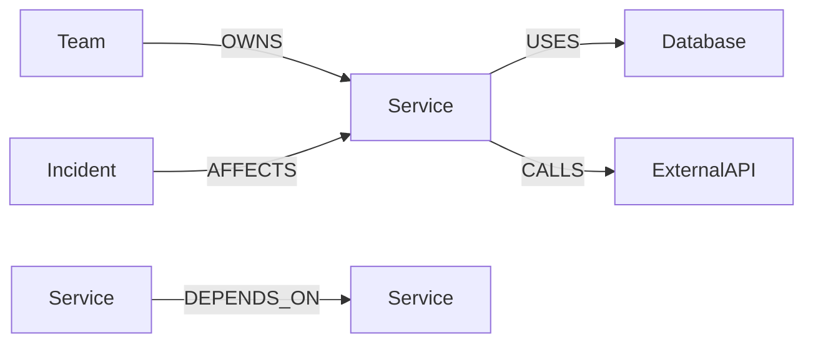
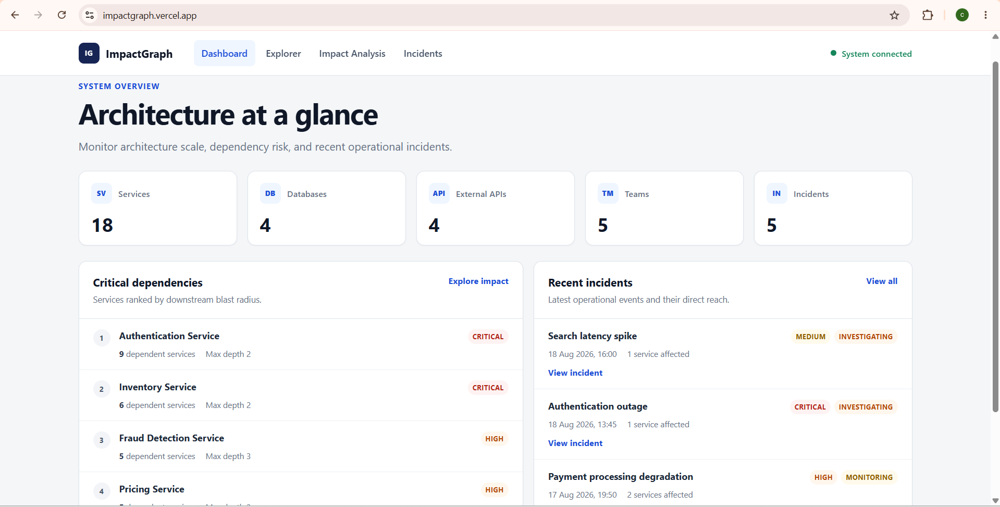
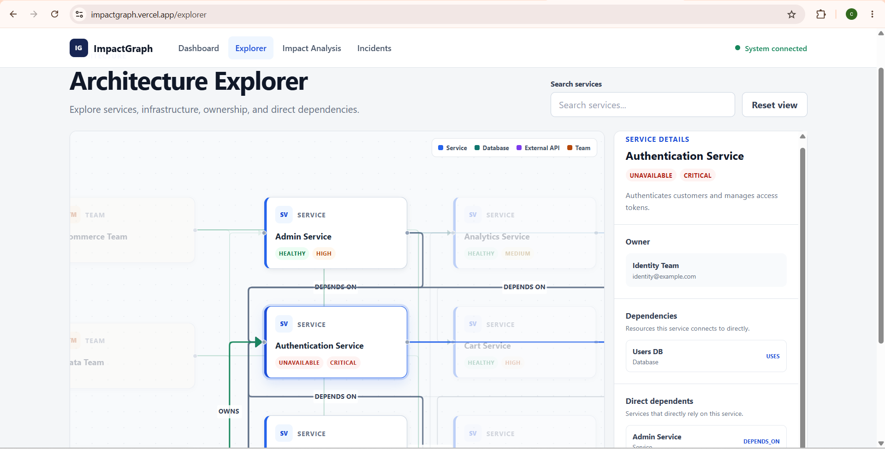
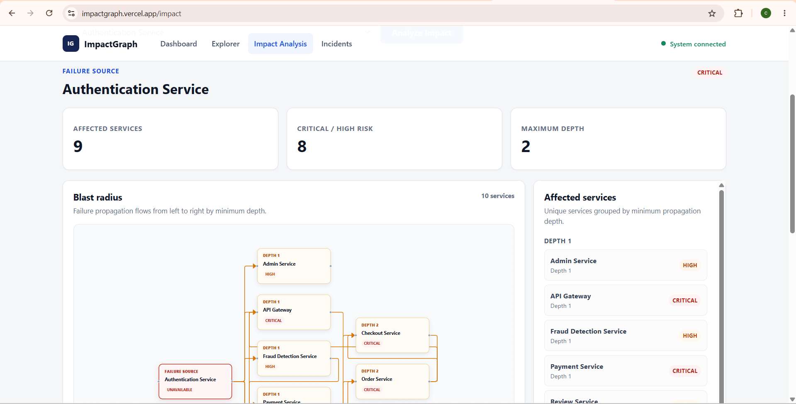
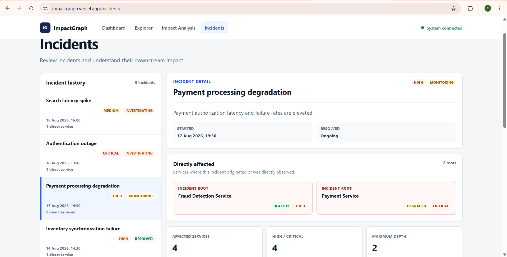

# ImpactGraph

Software Dependency & Incident Impact Explorer

ImpactGraph models a software architecture as a graph so teams can explore service dependencies, understand failure blast radius, and trace how operational incidents may propagate through connected systems.

## Live Demo

- Frontend: [impactgraph.vercel.app](https://impactgraph.vercel.app)
- Backend API: [impactgraph-api.onrender.com](https://impactgraph-api.onrender.com)
- Health endpoint: [impactgraph-api.onrender.com/api/health](https://impactgraph-api.onrender.com/api/health)

The CognoDB instance must remain available for live graph-backed functionality.

## Features

- System dashboard with architecture counts, critical dependency ranking, and recent incidents
- Architecture Explorer with an interactive dependency graph and service search
- Service details covering ownership, direct dependencies, and direct dependents
- Multi-hop impact analysis with blast-radius metrics and explanatory propagation paths
- Incident exploration with direct roots, downstream impact, and multi-root propagation
- Deterministic graph layouts and API ordering
- Responsive loading, empty, retry, and controlled error states

## Architecture

```text
React / Vite frontend
        |
        | HTTPS REST API (Axios)
        v
Node.js / Express backend
        |
        | Neo4j Bolt protocol (neo4j-driver)
        v
CognoDB graph database
```

The frontend is hosted on Vercel, the Express API is hosted on Render, and CognoDB stores the graph. Backend responsibilities follow the implemented layering:

```text
Route
  ↓
Controller
  ↓
Service
  ↓
Repository / Cypher
  ↓
CognoDB
```

Repositories own parameterized Cypher queries, read-session lifecycles, and conversion from Neo4j values to plain JSON responses.

## Graph Data Model



### Node labels and properties

Every seeded node also has `dataset: "impactgraph"`, which scopes application queries and seed cleanup.

| Label | Purpose | Implemented properties |
| --- | --- | --- |
| `Service` | Deployable application service | `id`, `name`, `description`, `status`, `criticality`, `dataset` |
| `Database` | Data store used by services | `id`, `name`, `engine`, `status`, `criticality`, `dataset` |
| `ExternalAPI` | Third-party API called by a service | `id`, `name`, `provider`, `status`, `dataset` |
| `Team` | Team responsible for services | `id`, `name`, `email`, `dataset` |
| `Incident` | Operational event affecting one or more services | `id`, `title`, `severity`, `status`, `startedAt`, `resolvedAt`, `description`, `dataset` |

### Relationships

| Relationship | From | To | Meaning |
| --- | --- | --- | --- |
| `DEPENDS_ON` | `Service` | `Service` | The source service requires the target service. |
| `USES` | `Service` | `Database` | The service uses the database. |
| `CALLS` | `Service` | `ExternalAPI` | The service calls the external provider API. |
| `OWNS` | `Team` | `Service` | The team owns the service. |
| `AFFECTS` | `Incident` | `Service` | The incident directly affects the service. |

## Why a Graph Database?

Software architecture is highly connected: dependencies, infrastructure usage, ownership, and incidents are relationships rather than isolated records. CognoDB lets ImpactGraph traverse those relationships directly instead of implementing recursive application-side joins.

The stored dependency direction is:

```text
dependent -[:DEPENDS_ON]-> dependency
```

When a dependency fails, impact analysis traverses that relationship in reverse with a bounded variable-length pattern equivalent to `DEPENDS_ON*1..6`. This finds direct and indirect dependents, calculates their minimum distance from the failed service, and returns explanatory paths. The same approach supports incidents with one or multiple directly affected root services while deduplicating downstream services.

## Multi-Hop Impact Analysis

The deterministic Authentication example produces:

| Metric | Value |
| --- | ---: |
| Failed service | Authentication Service |
| Affected services | 9 |
| High / critical | 8 |
| Maximum minimum-depth | 2 |

One explanatory path is:

```text
Authentication → Payment → Checkout → Storefront
```

Impact depth is the **minimum dependency distance** to each affected service, not necessarily the length of every explanatory path. Storefront therefore has a minimum depth of 2 even though the path above reaches it through three propagation edges.

## Seed Dataset

The seed creates a fixed e-commerce architecture:

| Node label | Count |
| --- | ---: |
| `Service` | 18 |
| `Database` | 4 |
| `ExternalAPI` | 4 |
| `Team` | 5 |
| `Incident` | 5 |
| **Total nodes** | **36** |

| Relationship | Count |
| --- | ---: |
| `DEPENDS_ON` | 29 |
| `USES` | 11 |
| `CALLS` | 4 |
| `OWNS` | 18 |
| `AFFECTS` | 6 |
| **Total relationships** | **68** |

Run the seed from `backend`:

```bash
npm run seed
```

The script creates idempotent uniqueness constraints, deletes only nodes marked with `dataset: "impactgraph"`, and recreates and validates the deterministic dataset in a write transaction. It is designed to be safely rerunnable without duplicating data.

## Technology Stack

| Area | Technologies |
| --- | --- |
| Frontend | React, Vite, React Router, Axios, React Flow (`@xyflow/react`), CSS |
| Backend | Node.js, Express, `neo4j-driver`, `dotenv`, `cors` |
| Database | CognoDB |
| Deployment | Vercel, Render |

## Project Structure

```text
impactgraph/
├── backend/
│   ├── scripts/
│   │   └── seed.js
│   ├── src/
│   │   ├── config/
│   │   ├── controllers/
│   │   ├── repositories/
│   │   ├── routes/
│   │   ├── services/
│   │   ├── utils/
│   │   └── app.js
│   ├── .env.example
│   ├── package.json
│   └── server.js
├── frontend/
│   ├── src/
│   │   ├── components/
│   │   ├── layouts/
│   │   ├── pages/
│   │   ├── services/
│   │   ├── styles/
│   │   ├── App.jsx
│   │   └── main.jsx
│   ├── .env.example
│   ├── package.json
│   ├── vercel.json
│   └── vite.config.js
└── README.md
```

## API Endpoints

| Method | Endpoint | Purpose |
| --- | --- | --- |
| `GET` | `/api/health` | Execute a database connectivity probe. |
| `GET` | `/api/dashboard` | Return dataset node counts. |
| `GET` | `/api/services` | List services in deterministic name order. |
| `GET` | `/api/services/:id` | Return a service, owner, dependencies, and direct dependents. |
| `GET` | `/api/services/:id/impact` | Return multi-hop downstream impact and explanatory paths. |
| `GET` | `/api/graph` | Return architecture nodes and non-incident relationships. |
| `GET` | `/api/critical-dependencies` | Rank services by downstream dependency reach. |
| `GET` | `/api/incidents` | List incidents and their directly affected service counts. |
| `GET` | `/api/incidents/:id` | Return incident roots, downstream impact, and paths. |

The backend also exposes `GET /` as a minimal API-running response.

## Frontend Routes

| Route | Page |
| --- | --- |
| `/` | Dashboard with system totals, dependency risks, and recent incidents |
| `/explorer` | Interactive architecture graph and service details |
| `/impact` | Service selection and multi-hop blast-radius analysis |
| `/incidents` | Incident history with direct and downstream impact |

## Local Setup

### Prerequisites

- Node.js and npm
- A running CognoDB instance
- Valid CognoDB URI, username, and password

### Clone

```bash
git clone https://github.com/charanramagiri/impactgraph.git
cd impactgraph
```

### Backend

```bash
cd backend
npm install
```

Copy `backend/.env.example` to `backend/.env`, then replace only the CognoDB placeholders with your private connection values. Do not commit the resulting file.

```env
PORT=5000
FRONTEND_ORIGIN=http://localhost:5173
COGNODB_URI=bolt+s://your-instance.databases.cognodb.cloud
COGNODB_USER=cognodb
COGNODB_PASSWORD=your-password
```

Seed and start the API:

```bash
npm run seed
npm run dev
```

The backend runs at `http://localhost:5000`.

### Frontend

From the project root:

```bash
cd frontend
npm install
```

Copy `frontend/.env.example` to `frontend/.env`:

```env
VITE_API_URL=http://localhost:5000/api
```

Start the frontend:

```bash
npm run dev
```

The frontend runs at `http://localhost:5173`. The backend's `FRONTEND_ORIGIN` must allow this exact frontend origin.

## Environment Variables

| Application | Variable | Purpose |
| --- | --- | --- |
| Backend | `PORT` | Express listening port; defaults to `5000`. |
| Backend | `FRONTEND_ORIGIN` | Exact origin allowed by CORS. |
| Backend | `COGNODB_URI` | CognoDB Bolt URI. |
| Backend | `COGNODB_USER` | CognoDB username. |
| Backend | `COGNODB_PASSWORD` | CognoDB password. |
| Frontend | `VITE_API_URL` | Base URL for Axios API requests. |

Never commit real credentials or `.env` files. Both application directories ignore local environment files.

## Error Handling

- Service and incident IDs are validated before repository queries; invalid IDs return controlled `400` responses.
- Malformed request paths and invalid JSON bodies return controlled `400` responses.
- Missing services, incidents, and API routes return controlled `404` responses.
- Unavailable CognoDB connections return a controlled `503` response.
- Other unexpected backend failures return a controlled `500` response.
- Server logs use safe context and driver error codes; HTTP responses do not expose raw CognoDB errors, URIs, credentials, or stack traces.
- The frontend provides page-specific loading states, retry controls, empty states, and a global database health indicator.

## Deployment

### Frontend — Vercel

- Root directory: `frontend`
- `VITE_API_URL`: the Render backend URL ending in `/api`
- [`frontend/vercel.json`](frontend/vercel.json) rewrites routes to `index.html`, allowing direct refreshes on `/explorer`, `/impact`, and `/incidents` to resolve to the React application.

### Backend — Render

- Service type: Web Service
- Root directory: `backend`
- Configure `COGNODB_URI`, `COGNODB_USER`, `COGNODB_PASSWORD`, and `FRONTEND_ORIGIN` in Render.
- Set `FRONTEND_ORIGIN` to the exact Vercel frontend origin.

Production secrets belong in the hosting platforms' environment settings and must not be committed.

## Screenshots

<!-- Add Dashboard screenshot here -->


<!-- Add Architecture Explorer screenshot here -->



<!-- Add Impact Analysis screenshot here -->


<!-- Add Incidents screenshot here -->



## Design Decisions

- A deterministic, dataset-scoped seed makes demonstrations and validations repeatable.
- Repository modules isolate parameterized Cypher and database session handling.
- Multi-hop traversal and minimum-depth aggregation run in CognoDB rather than application-side recursion.
- API results and frontend graph layouts use deterministic ordering for stable output.
- Impact paths preserve graph explanations while summaries deduplicate affected services.
- Scope intentionally excludes authentication and CRUD in favor of graph exploration quality.
- Responsive layouts and explicit loading, empty, health, and retry states keep the UI usable under normal failure conditions.
